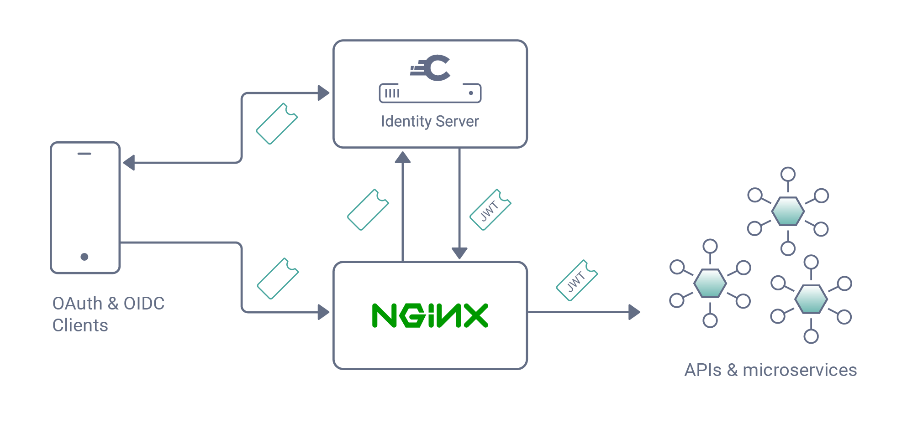

# Phantom Token NGINX Module

[](https://curity.io/resources/code-examples/status/)
[](https://curity.io/resources/code-examples/status/)

NGINX module that introspects access tokens according to [RFC 7662](https://tools.ietf.org/html/rfc7662), producing a "phantom token" that can be forwarded to back-end APIs and Web services.

More details can be found in [The Phantom Token Approach](https://curity.io/resources/learn/phantom-token-pattern/) article.

This module, when enabled, filters incoming requests, denying access to those which do *not* have a valid OAuth access token presented in an `Authorization` header. From this header, the access_token is extracted and introspected using the configured endpoint. Curity replies to this request according to the standard. For an active access token, the body of Curity's response contains the JWT that replaces the access token in the header of the request that is forwarded by NGINX to the back-end. If the token is not valid or absent, no request to the back-end is made and the caller is given a 401, unauthorized, error. This flow is shown in the following diagram:



The initial calls by the app (web or native) are done using [OpenID Connect](http://openid.net/specs/openid-connect-core-1_0.html) (OIDC). The important part is that the token that is issued is an opaque access token. It is a GUID or UUID or a few handfuls of random bytes; there is no identity-related data in this token. It is a _phantom_ of the actual user data, hence the name -- _phantom token_. The app presents the token to the NGINX gateway according to the _Bearer Token Usage_ specficiation (i.e., [RFC 6750](https://tools.ietf.org/html/rfc6750)). This standard says that the app should send the phantom token in the `Authorization` request header. 

Once the NGINX server receives the access token, this module will kick in. Using configuration like that below, this module will interrogate the request, find the token, and make a sideways call to Curity. This web service request will be done using the _Token Introspection_ standard ([RFC 7662](https://tools.ietf.org/html/rfc7662)) with an `Accept` type of `application/jwt` (as defined in [RFC 7519](https://tools.ietf.org/html/rfc7519#section-10.3.1)). This will cause Curity to return not JSON but just a JWT. Then, the module will forward the JWT token to the back-end APIs and microservices. 

If the module is also configured to cache the results of the call to Curity (which it should be for production cases), the phantom token will be used as a cache key for the corresponding JWT token. This will elevate the need for subsequent calls to Curity for as long as Curity tells the NGINX module it may cache the JWT for.

The tl;dr is a very simple API gateway that is blazing fast, highly scalable, and without any bells and whistles to get in the way. All the code is here, so it's easy to change and use with other OAuth servers even!

## Configuration Directives

### Required Configuration Directives

All the directives in this subsection are required; if any of these are omitted, the module will be disabled.

#### phantom_token

> **Syntax**: **`phantom_token`** `on` | `off`
>
> **Default**: *`off`*
>
> **Context**: `location`

#### phantom_token_client_credential

> **Syntax**: **`phantom_token_client_credential`** _`string`_ _`string`_ 
> 
> **Default**: *`—`*                                                                
> 
> **Context**: `location`                                                           
 
The client ID and secret of the OAuth client which will be used for introspection. The first argument to this directive is the client ID and the second is the secret. The maximum total length of the two arguments must be less than 255 characters. Both should be printable ASCII values; non-ASCII values _may_ work but are untested. If this directive is not configured, then the module will be disabled.

#### phantom_token_introspection_endpoint

> **Syntax**: **`phantom_token_introspection_endpoint`** _`string`_
>
> **Default**: *`—`*
>
> **Context**: `location`

The name of the location that proxies requests to Curity. Note that this location needs to be in the same server as the one referring to it using this directive.

Example configuration:

```nginx
server {
    location /api {
        ...
        phantom_token_introspection_endpoint my_good_location_name_for_curity;
    }
    
    location my_good_location_name_for_curity {
        ...
    }
}
```

### Optional Configuration Directives

The following directives are optional and do not need to be configured.

#### phantom_token_realm

> **Syntax**: **`phantom_token_realm`** _`string`_
> 
> **Default**: *`api`*
> 
> **Context**: `location`

The name of the protected realm or scope of protection that should be used when a client does not provide an access token.

Example configuration:

```nginx
location / {
   ...
   phantom_token_realm "myGoodRealm";
}   
```

#### phantom_token_scopes

> **Syntax**: **`phantom_token_scopes`** _`string`_
>
> **Default**: *`—`*
>
> **Context**: `location`

The space-separated list of scopes that the server should inform the client are required when it does not provide an access token.

Example configuration:

```nginx
location / {
   ...
   phantom_token_scopes "scope_a scope_b scope_c";
}
```

#### phantom_token_scope

> **Syntax**: **`phantom_token_scope`** _`string`_
>
> **Default**: *`—`*
>
> **Context**: `location`

An array of scopes that the server should inform the client are required when it does not provide an access token. If `phantom_token_scopes` is also configured, that value will supersede these.
 
Example configuration:
 
```nginx
location / {
   ...
   phantom_token_scope "scope_a";
   phantom_token_scope "scope_b";
   phantom_token_scope "scope_c";
}
```

## Sample Configuration

### Loading the Module
If the module is downloaded from GitHub or compiled as a shared library (the default) and not explicitly compiled into NGINX, it will need to be loaded using the [load_module](http://nginx.org/en/docs/ngx_core_module.html#load_module) directive. This needs to be done in the _main_ part of the NGINX configuration:

```nginx
load_module modules/ngx_curity_http_phantom_token_module.so;
```

The file can be an absolute or relative path. If it is not absolute, it should be relative to the NGINX root directory.

### Simple Configuration
The following is a simple configuration that might be used in demo or development environments where the NGINX reverse proxy is on the same host as the Curity Identity Server:

```nginx
server {
    location /api {
        proxy_pass         https://example.com/api;

        phantom_token on;
        phantom_token_client_credential "client_id" "client_secret";
        phantom_token_introspection_endpoint curity;
    }
    
    location curity {
        proxy_pass "https://curity.example.com/oauth/v2/introspection";
    }
}
```

### Complex Configuration
The following is a more complex configuration where the NGINX reverse proxy is on a seperate host then the Curity Identity Server:

```nginx
server {
    server_name server1.example.com;n
    location /api {
        proxy_pass         https://example.com/api;

        phantom_token on;
        phantom_token_client_credential "client_id" "client_secret";
        phantom_token_introspection_endpoint curity;
        
        phantom_token_realm "myGoodAPI";
        phantom_token_scopes "scope_a scope_b scope_c";
    }
    
    location curity {
        proxy_pass "https://server2.example.com:8443/oauth/v2/introspection";
    }
}

server {
    listen 8443;
    server_name server2.example.com;
    location / {
        proxy_pass "https://curity.example.com";
    }
}
```
        
### More Advanced Configuration with Separate Servers and Caching
This module takes advantage of NGINX built-in _proxy_cache_ directive. In order to be able to cache the requests made to the introspection endpoint, except of the `proxy_cache_path` in http context and `proxy_cache` in location context, you have to add the following 3 directives in the location context of the introspection endpoint.

- `proxy_cache_methods POST;` POST requests are not cached by default.
- `proxy_cache_key $request_body;` The key of the cache is related to the _access_token_ sent in the original request. Different requests using the same _access_token_ reach the same cache.
- `proxy_ignore_headers Set-Cookie;` NGINX will not cache the response if `Set-Cookie` header is not ignored.

```nginx
http {
    proxy_cache_path /path/to/cache/cache levels=1:2 keys_zone=my_cache:10m max_size=10g
                     inactive=60m use_temp_path=off;
    server {
        server_name server1.example.com;
        location /api {
            proxy_pass         https://example.com/api;

            phantom_token on;
            phantom_token_client_credential "client_id" "client_secret";
            phantom_token_introspection_endpoint curity;
            phantom_token_scopes "scope_a scope_b scope_c";
            phantom_token_realm "myGoodAPI";
        }
        
        location curity {
            proxy_pass "https://server2.example.com:8443/oauth/v2/introspection";
            
            proxy_cache_methods POST;
            proxy_cache my_cache;
            proxy_cache_key $request_body;
            proxy_ignore_headers Set-Cookie;
        }
    }
    
    server {
        listen 8443;
        server_name server2.example.com;
        location / {
            proxy_pass "https://curity.example.com";
        }
    }
}   
```

## Installation and Development

To build this module, simply do the following:

```sh
./configure
make && make install
```

This will download the NGINX source code if it is not already local. If it is, the location may be provided when prompted. By default, version 1.19.0 will be downloaded; a different version can be fetched by setting `NGINX_VERSION` before running the `configure` script. Any [additional parameters](http://nginx.org/en/docs/configure.html) (e.g., `--prefix`) that NGINX's `configure` script supports can also be provided. When this module's `configure` script is run, it will pass along `--with-compat` to NGINX's script. It asks if a dynamic module should be created (thus passing along `--add-dynamic-module`) or if the module should be compiled into the NGINX binary (thus passing `--add-module`); by default, it created a dynamically-linked module. It will also ask if debug flags should be enabled; if so, `--with-debug` and certain GCC flags will be passed on to NGINX's `configure` script to make debugging easier. After the script is run, just execute `make && make install`. These too will delegate to NGINX's `Makefile`. After this, the module will be usable and can be configured as described above.

> *WARNING* If `--without-pcre`, `--without-http_gzip_module` and potentially other flags are provided to the `configure` script and a module is created, it will _not_ be compatible with NGINX Plus or the pre-compiled open source NGINX binaries; if you include such flags (when building the module), you will only be able to load it into a custom build of NGINX that also excludes the same functionality. If the `configure` script exits with an error about a missing dependency, like [PCRE](https://www.pcre.org/) and [zlib](http://zlib.net/), install those instead of excluding them if compatibility with pre-build NGINX binaries is desired.</p>

The code can be imported into CLion 2020.2 or newer as a Makefile project. To do this though, you need to run the `configure` script _without_ running `make` or `make all`. Also, CLion will *not* work if the clean target it set since this target deletes the Makefile, which is generated by the `configure` script. If this process is followed, the project will import easily and all the smart IDE features will work.   

## Certifying a Release

To certify that a build is compatible with NGINX+, a shared library needs to be built and it must be tested with NGINX's certification test suite. For some background on this, refer to the [NGINX Plus Certified Modules Program documentation](https://www.nginx.com/partners/certified-module-program-documentation/#tech-doc-instructions-building). As described there:

1. A module must be built for each supported platform (see below). 
2. [NGINX+ must be installed](https://docs.nginx.com/nginx/admin-guide/installing-nginx/installing-nginx-plus/) on each of these platforms as well.
3. The [certification test suite](https://www.nginx.com/partners/certified-module-program-documentation/#tech-doc-instructions-self-cert) and [its dependencies](https://www.nginx.com/partners/certified-module-program-documentation/#appendix) must be installed.
4. With the NGINX+ service stopped, run the test suite, like this for example:

```sh
sudo -u nginx \
    TEST_NGINX_BINARY=/usr/sbin/nginx \
    TEST_NGINX_GLOBALS="load_module /tmp/modules/ngx_curity_http_phantom_token_module.so;" \
    TEST_NGINX_GLOBALS_HTTP="phantom_token off;" \
    prove -v . > ../nginx-plus-module-prove-test-verbose 2>&1
```

If all certification tests and the phantom-token specific tests (see below) pass, the build can be certified. Also, it should be released on GitHub.

## Building dynamic modules

You can build the module (for all supported platforms) using the `build.sh` script.

This script reuquires docker and builds locally all 10 platforms that are listed below in Releases. You can build for any NGINX release by running it like so:

`NGINX_VERSION=X.X.X ./build.sh`

After running, all 10 `.so` files will be in the `./build` directory.

## Compatibility

This module is compatible with Curity version >= 2.2. It has been tested with NGINX 1.13.7 (NGINX Plus Release 14) and NGINX 1.13.10 (NGINX Plus Release 15). It is likely to work with other, newish versions of NGINX, but only these have been tested, pre-built and verified.

### Releases

Pre-built binaries of this module are provided for the following versions of NGINX on the corresponding operating system distributions:

|                                   | NGINX 1.17.9 / NGINX Plus R21 | NGINX 1.19.0 / NGINX Plus R22    | NGINX 1.19.5 / NGINX Plus R23 |
| ----------------------------------|:-----------------------------:|:---------------------------------:|:---------------------------------:|
| Amazon Linux                      | [⇓](https://github.com/curityio/nginx_phantom_token_module/releases/download/1.1.1/amzn.ngx_curity_http_phantom_token_module_1.17.9.so)           | [⇓](https://github.com/curityio/nginx_phantom_token_module/releases/download/1.1.1/amzn.ngx_curity_http_phantom_token_module_1.19.0.so)           | [⇓](https://github.com/curityio/nginx_phantom_token_module/releases/download/1.1.1/amzn.ngx_curity_http_phantom_token_module_1.19.5.so) | 
| Amazon Linux 2                    | [⇓](https://github.com/curityio/nginx_phantom_token_module/releases/download/1.1.1/amzn2.ngx_curity_http_phantom_token_module_1.17.9.so)          | [⇓](https://github.com/curityio/nginx_phantom_token_module/releases/download/1.1.1/amzn2.ngx_curity_http_phantom_token_module_1.19.0.so)          | [⇓](https://github.com/curityio/nginx_phantom_token_module/releases/download/1.1.1/amzn2.ngx_curity_http_phantom_token_module_1.19.5.so) |
| CentOS 7.0+                       | [⇓](https://github.com/curityio/nginx_phantom_token_module/releases/download/1.1.1/centos.7.ngx_curity_http_phantom_token_module_1.17.9.so)       | [⇓](https://github.com/curityio/nginx_phantom_token_module/releases/download/1.1.1/centos.7.ngx_curity_http_phantom_token_module_1.19.0.so)       | [⇓](https://github.com/curityio/nginx_phantom_token_module/releases/download/1.1.1/centos.7.ngx_curity_http_phantom_token_module_1.19.5.so) |
| CentOS 8.0+                       | [⇓](https://github.com/curityio/nginx_phantom_token_module/releases/download/1.1.1/centos.8.ngx_curity_http_phantom_token_module_1.17.9.so)       | [⇓](https://github.com/curityio/nginx_phantom_token_module/releases/download/1.1.1/centos.8.ngx_curity_http_phantom_token_module_1.19.0.so)       | [⇓](https://github.com/curityio/nginx_phantom_token_module/releases/download/1.1.1/centos.8.ngx_curity_http_phantom_token_module_1.19.5.so) |
| Debian 9.0 (Stretch)              | [⇓](https://github.com/curityio/nginx_phantom_token_module/releases/download/1.1.1/debian.stretch.ngx_curity_http_phantom_token_module_1.17.9.so) | [⇓](https://github.com/curityio/nginx_phantom_token_module/releases/download/1.1.1/debian.stretch.ngx_curity_http_phantom_token_module_1.19.0.so) | [⇓](https://github.com/curityio/nginx_phantom_token_module/releases/download/1.1.1/debian.stretch.ngx_curity_http_phantom_token_module_1.19.5.so) |
| Debian 10.0 (Buster)              | [⇓](https://github.com/curityio/nginx_phantom_token_module/releases/download/1.1.1/debian.buster.ngx_curity_http_phantom_token_module_1.17.9.so)  | [⇓](https://github.com/curityio/nginx_phantom_token_module/releases/download/1.1.1/debian.buster.ngx_curity_http_phantom_token_module_1.19.0.so)  | [⇓](https://github.com/curityio/nginx_phantom_token_module/releases/download/1.1.1/debian.buster.ngx_curity_http_phantom_token_module_1.19.5.so) |
| Alpine                            | [⇓](https://github.com/curityio/nginx_phantom_token_module/releases/download/1.1.1/alpine.ngx_curity_http_phantom_token_module_1.17.9.so)         | [⇓](https://github.com/curityio/nginx_phantom_token_module/releases/download/1.1.1/alpine.ngx_curity_http_phantom_token_module_1.19.0.so)         | [⇓](https://github.com/curityio/nginx_phantom_token_module/releases/download/1.1.1/alpine.ngx_curity_http_phantom_token_module_1.19.5.so) |
| Ubuntu 18.04 LTS (Bionic Beaver)  | [⇓](https://github.com/curityio/nginx_phantom_token_module/releases/download/1.1.1/ubuntu.18.04.ngx_curity_http_phantom_token_module_1.17.9.so)   | [⇓](https://github.com/curityio/nginx_phantom_token_module/releases/download/1.1.1/ubuntu.18.04.ngx_curity_http_phantom_token_module_1.19.0.so)   | [⇓](https://github.com/curityio/nginx_phantom_token_module/releases/download/1.1.1/ubuntu.18.04.ngx_curity_http_phantom_token_module_1.19.5.so) |
| Ubuntu 20.04 LTS (Focal Fossa)    | [⇓](https://github.com/curityio/nginx_phantom_token_module/releases/download/1.1.1/ubuntu.20.04.ngx_curity_http_phantom_token_module_1.17.9.so)   | [⇓](https://github.com/curityio/nginx_phantom_token_module/releases/download/1.1.1/ubuntu.20.04.ngx_curity_http_phantom_token_module_1.19.0.so)   | [⇓](https://github.com/curityio/nginx_phantom_token_module/releases/download/1.1.1/ubuntu.20.04.ngx_curity_http_phantom_token_module_1.19.5.so) |

## Testing

To test this module, you'll need the [Test::Nginx Perl module](https://github.com/openresty/test-nginx) and [docker-compose](https://docs.docker.com/compose/install/) installed. 

To run the tests do the following:

* run `./configure`, make sure you select _No_ for Dynamic module 
* run `make`
* Setup an `ADMIN_PASSWORD` and the `LICENSE_KEY` for the Curity Identity server that is used in tests*
* run `make test`

This, will run `prove` passing in the test or test directory (`t`). 

Internet access to `hub.docker.com` is required for the `curity.t` test suite to pass, if the images required are not present locally.

\* These variables can be set inline, in your environment or in the docker-compose.yaml file.

NGINX must be in the system path; the tests will run the first `nginx` command that's found or bail if none is located. Also, the tests assume that the module is statically linked with NGINX. Before running them, be sure that the module is linked into the NGINX binary. Also, debug logging must be compiled into NGINX for some tests in `config.t` to pass. (This is the case if `nginx -V` includes `--with-debug` in the output.)

## Status
This module is fit for production usage. 

## More Information
For more information about Curity, its capabilities, and how to use it to issue phantom tokens, visit [curity.io](https://curity.io/product/token-service/#phantom_tokens). For background information on using Curity for API access, consult the [API integration section of the Curity developer manual](https://support.curity.io/docs/latest/developer-guide/api-integration/overview.html). For additional insights in how to apply this pattern to microservices and APIs, read _[How to Control User Identity within Microservices](http://nordicapis.com/how-to-control-user-identity-within-microservices/)_ on the Nordic APIs blog.

## Licensing

This software is copyright (C) 2017 Curity AB. It is open source software that is licensed under the [Apache v. 2](LICENSE). For commercial support of this module, please contact [Curity sales](mailto:sales@curity.io).
